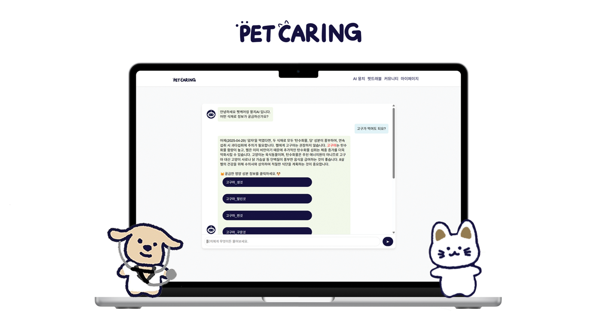
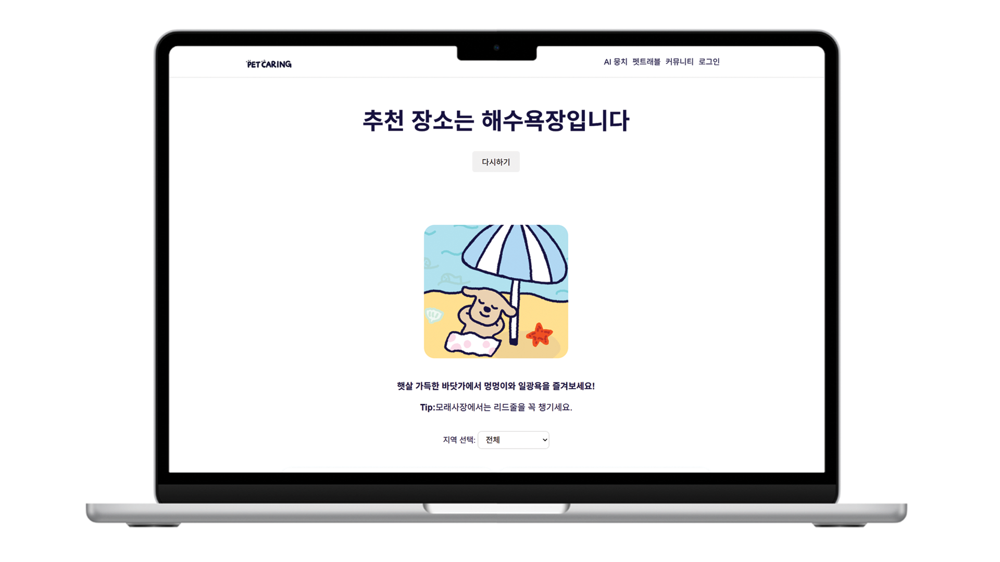
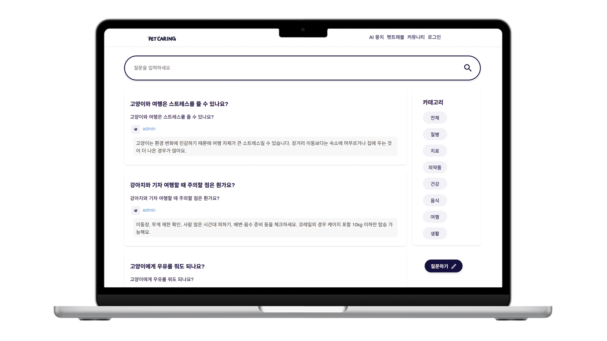
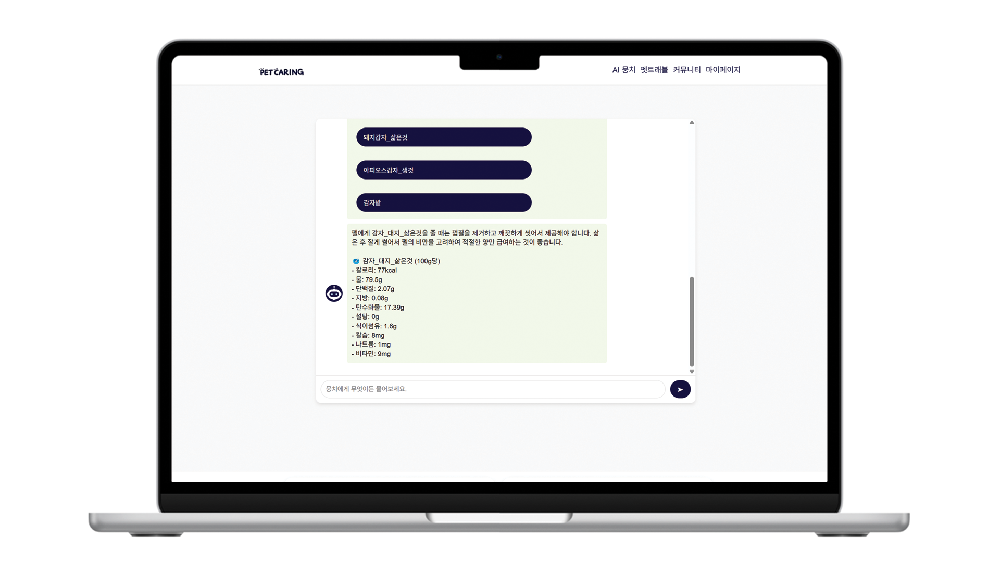

<body>
  

  
</body>

<!-- Using HTML to center the abstract -->

  

    <h2>Abstract</h2>
    

      강아지 고양이 영양 정보를 AI 뭉치에게 물어보세요! 
      강아지 고양이에게 일반식과 영양제를 줄 때, AI 뭉치를 이용하면 영양성분 정보를 빠르고 간편하게 얻을 수 있습니다. 
      어디놀러갈지 고민 될때는 장소 추천 서비스를, 질문은 커뮤니티를 이용해보세요.
    

  

 
 

  

    <h2>Abstract</h2>
    

      강아지 고양이 영양 정보를 AI 뭉치에게 물어보세요! 
      강아지 고양이에게 일반식과 영양제를 줄 때, AI 뭉치를 이용하면 영양성분 정보를 빠르고 간편하게 얻을 수 있습니다. 
      어디놀러갈지 고민 될때는 장소 추천 서비스를, 질문은 커뮤니티를 이용해보세요.
    

  

  

    <h2>Abstract</h2>
    

      강아지 고양이 영양 정보를 AI 뭉치에게 물어보세요! 
      강아지 고양이에게 일반식과 영양제를 줄 때, AI 뭉치를 이용하면 영양성분 정보를 빠르고 간편하게 얻을 수 있습니다. 
      어디놀러갈지 고민 될때는 장소 추천 서비스를, 질문은 커뮤니티를 이용해보세요.
    

  

  

    <h2>Abstract</h2>
    

      강아지 고양이 영양 정보를 AI 뭉치에게 물어보세요! 
      강아지 고양이에게 일반식과 영양제를 줄 때, AI 뭉치를 이용하면 영양성분 정보를 빠르고 간편하게 얻을 수 있습니다. 
      어디놀러갈지 고민 될때는 장소 추천 서비스를, 질문은 커뮤니티를 이용해보세요.
    

  

   

<!-- Dataset Download Buttons -->
  

## Web site
펫케어링 웹사이트에서 다양한 서비스를 경험해보세요.

  <a class="button is-primary" href="https://petcaring.site/" target="_blank">site</a>

### 뭉치 AI (로그인시 이용 가능)

  <a class="button is-primary" href="http://43.202.9.123/html/chat/chatbot.html" target="_blank">AI</a>

  

### ISP pipeline
Coming soon

</code></pre>

